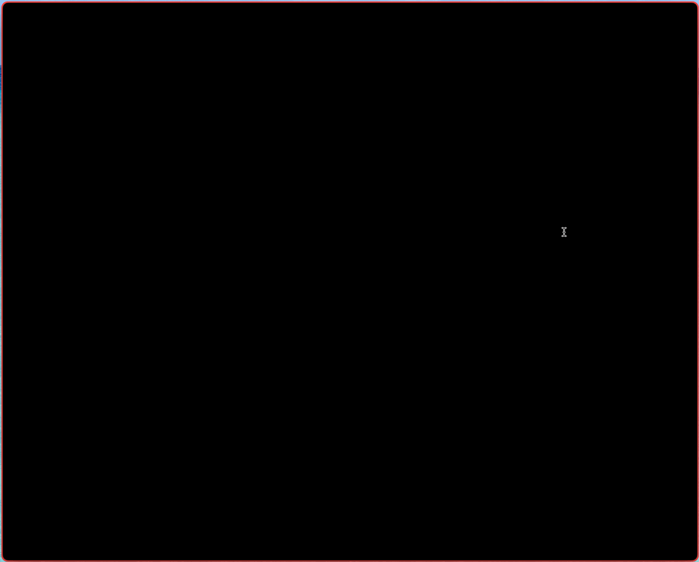

# **♟️ Chessterm – A Terminal-Based Chess Interface**
A Rust-powered 🦀 chess engine in a terminal


## 🚀 Why I Built This
As I was preparing for a chess competition, I wanted to become **more proficient 
with chess notation** so I could write down my moves quickly. Instead of using 
an existing tool, I decided to **build my own chess engine** from scratch in 
Rust—just because

Unlike many other projects that integrate with existing chess engines like 
[Stockfish](https://stockfishchess.org), I wanted to **build everything from 
scratch** for the learning experience. My goal was not to create a 
Stockfish-level engine but rather a **decent, performant, and functional** chess 
engine that enforces strict PGN notation and helps me improve my notation 
skills

This project also served as an opportunity to:
- **Learn terminal UI (TUI) development** – I had never really work with TUI 
  before so it was a great learning experience
- **Dive deep into chess engine implementation** – I initially thought it would
  be simple, but handling castling, pins, en passant, and stalemate detection 
  turned out to be incredibly complex
- **Enforce strict [PGN](https://en.wikipedia.org/wiki/Portable_Game_Notation)
  notation** – chessterm only allows moves via PGN input, forcing me to get
  better at writing notation
- **Understand move generation & validation** – Building a chess engine required 
  dealing with bitboard-based move generation, attack masks, and legal move 
  enforcement

Building a chess engine was far harder than expected—handling pins, checks,
and legal move validation was an absolute nightmare. But in the end, it was 
an incredibly rewarding experience, and I gained a much deeper understanding 
of how chess engines work

## 🎮 Human vs Human Only
chessterm is **strictly designed for 2-player, human-vs-human chess**
- **❌ No AI Opponent** – moves must be manually entered using **PGN notation**
- **✅ Ideal for Chess Study** – Useful for **notation practice, replaying games, and move visualization**
- **🚫 No Plans for AI Integration** – The goal of this project was to 
  **improve notation practice and understand chess engine mechanics, not to 
  create a competitive AI**

## 🚫 Known Limitations
chessterm enforces **all standard chess rules**, but **does not implement** 
the following draw conditions:
- **Threefold Repetition Rule** – The game does not check if a position has repeated three times
- **50-Move Rule** – The engine does not track move count for automatic draws

There are **no plans to implement these**, as the primary goal of chessterm is 
**notation practice, not full rule enforcement**

## ⚠️Compatibility Notice
**Only tested on macOS.**

- **✅ Best Experience**: [Kitty](https://sw.kovidgoyal.net/kitty/) (renders perfectly).  
- **⚠️ Usable with Issues**: [iTerm2](https://iterm2.com) (flickering may occur).
  - <details>
    <summary>Flickering in iTerm2</summary>

    

    </details>
 
  - <details>
    <summary>Use `--halfblocks` mode to reduce flickering</summary>
    
    
    
    </details>
- **❌ Not Supported**: **Mac’s default Terminal.app** (images do not render correctly).

## 📦 Installation

You can download the [latest release](https://github.com/ronaldsuwandi/chessterm/releases)
and extract the package

```
tar -xzvf chessterm-<os>-<version>.tar.gz    
```

And run the binary either 

```
chessterm
```

or 

```
chessterm --halfblocks
```

to use halfblocks rendering (for iTerm2)

Make sure your terminal size is at least `132x46` for proper rendering

If you are interested to build and compile, ensure that you have [Rust](https://www.rust-lang.org/tools/install) 
1.8 and above installed

### Run in debug mode
```
cargo run
```

Optionally you can also run using halfblocks rendering
```
cargo run -- --halfblocks
```

### Run unit tests
```
cargo test
```

### Build and run
Build 
```
cargo build --release
```

To run the binary
```
target/release/chessterm
```

Optionally you can also run using halfblocks rendering
```
target/release/chessterm --halfblocks
```

## 🛠️ Key Technical Highlights
### Bitboard-based data structure
When researching chess engines, I discovered [Bitboard](https://en.wikipedia.org/wiki/Bitboard) 
data structure which is a highly efficient way to represent chess positions and 
commonly used in other chess engines

Instead of using a 2D array for the chessboard, pieces positions are 
represented using bitboard (`u64`) where each bit corresponds to a square

For example, this is how a **white pawn at d2 (square 11 in 0-based indexing)** is represented:

`00000000 00000000 00001000 00000000 00000000 00000000 00000000 00000000`

Using **bitwise operations**, chessterm can:
- Quickly **shift bits** to generate potential pawn moves (`board.white_pawns << 8` for single advance).
- Use **AND masks** to detect if a move is blocked.
- Compute **attack masks for sliding pieces** using precomputed rays.

```rust
fn generate_pawn_moves(pawns: u64, empty_squares: u64) -> u64 {
    let single_push = (pawns << 8) & empty_squares;
    let double_push = ((single_push & RANK_4) << 8) & empty_squares;
    single_push | double_push
}
```

#### Bitboard challenges
While efficient, it makes computation a lot trickier and challenging, dealing 
with move generation, blocking piece, castling, stalemate, etc were hard to 
implement

Another reason why this is challenging is that bitboard bit position is on 
the reversed order compared to actual chessboard

In bitboard this is how we the bits are represented where least significant bit 
(LSB) is all the way to the right and that corresponds to A1
```
63 62 61 60 59 58 57 56
55 54 53 52 51 50 49 48
47 46 45 44 43 42 41 40
39 38 37 36 35 34 33 32
31 30 29 28 27 26 25 24
23 22 21 20 19 18 17 16
15 14 13 12 11 10  9  8
 7  6  5  4  3  2  1  0
```

How the bitboard corresponds to the chess position
```
H8 G8 F8 E8 D8 C8 B8 A8
H7 G7 F7 E7 D7 C7 B7 A7
H6 G6 F6 E6 D6 C6 B6 A6
H5 G5 F5 E5 D5 C5 B5 A5
H4 G4 F4 E4 D4 C4 B4 A4
H3 G3 F3 E3 D3 C3 B3 A3
H2 G2 F2 E2 D2 C2 B2 A2
H1 G1 F1 E1 D1 C1 B1 A1
```

Ordering of actual chess board position is reversed horizontally
```
A8 B8 C8 D8 E8 F8 G8 H8
A7 B7 C7 D7 E7 F7 G7 H7
A6 B6 C6 D6 E6 F6 G6 H6
A5 B5 C5 D5 E5 F5 G5 H5
A4 B4 C4 D4 E4 F4 G4 H4
A3 B3 C3 D3 E3 F3 G3 H3
A2 B2 C2 D2 E2 F2 G2 H2
A1 B1 C1 D1 E1 F1 G1 H1
```

Finally, there are plenty of edge cases that needs to be taken care of such as
double pawn resolving, en passant capture, simulate king move can't enter into 
attack mask, pawn has separate attack mask, etc

### Precomputed attack and move masks
To avoid generating moves for every piece, chessterm does **precompute moves** 
(including attack masks) for every position and piece types which are then 
**further trimmed into pseudolegal moves** before finally validating legality

#### How It Works
- Knights and Kings → Use lookup tables for fast move retrieval
- Sliding Pieces (Bishops, Rooks, Queens) → Use ray-based attack masks
- Pawns → Separate move masks (for advancing) and attack masks 
  (for capturing diagonally)

```rust
pub const KNIGHT_MOVES: [u64; 64] = precompute_moves!(precompute_knight_moves);
fn precompute_knight_moves(index: u8) -> u64 {
    let bitboard = 1u64 << index;
    ((bitboard << 17) & !MASK_FILE_A) | ((bitboard << 15) & !MASK_FILE_H) |
    ((bitboard << 10) & !(MASK_FILE_A | MASK_FILE_B)) | ((bitboard << 6) & !(MASK_FILE_G | MASK_FILE_H)) |
    ((bitboard >> 17) & !MASK_FILE_H) | ((bitboard >> 15) & !MASK_FILE_A) |
    ((bitboard >> 10) & !(MASK_FILE_G | MASK_FILE_H)) | ((bitboard >> 6) & !(MASK_FILE_A | MASK_FILE_B))
}
```

Once we have precomputed move, we can then generate the **pseudolegal moves**
```rust
pub fn compute_knights_moves(board: &Board, is_white: bool) -> u64 {
    let mut moves = 0u64;
    let own_pieces: u64;
    let mut knights: u64;
    if is_white {
        knights = board.white_knights;
        own_pieces = board.white_pieces;
    } else {
        knights = board.black_knights;
        own_pieces = board.black_pieces;
    };

    while knights != 0 {
        let index = knights.trailing_zeros();

        // Add the knight's precomputed moves, excluding occupied by own
        moves |= KNIGHT_MOVES[index as usize] & !own_pieces;

        // Remove the processed knight (use lsb approach)
        knights &= knights - 1;
    }

    moves
}
```

### Move Validation Performance
While bitboards make move generation and checking for attacked piece is 
really fast, checking for checkmate/stalemate is **expensive in the current 
implementation**

To detect stalemate or checkmate
- The engine checks all possible legal moves
- Next it then **simulate each move** to check if the king is still in check
- When simulating the move, the pieces moves and attack masks have to be 
  recomputed because moving piece may block check or capture attackign piece
- If no legal moves exists, it's either checkmate or stalemate

### PGN-Only Input with Robust Parsing
- Parses PGN moves instead of allowing GUI selection
- Handles ambiguous moves (`Nbd2` vs `Nfd2`) correctly
- Validates special cases like castling and en passant

### Preloaded Images & Audio for Performance
- Chess piece images are preloaded in memory to prevent I/O lag
- Move sounds are buffered and played instantly

### Terminal UI with `ratatui` and `ratatui-image` for image rendering
- Optional unicode-based fallback (halfblocks) 
- Scrollbar integration for move history

### Debugging and Helper functions
- `render_bitboard` allow to render bitboard in terminal with custom character, 
  useful for debugging
- `Board::from_fen()` allow to setup the chess piece using [FEN](https://en.wikipedia.org/wiki/Forsyth–Edwards_Notation) 
  notation (only the first part of the notation, to setup the pieces)
- `bitboard_single` to return bitboard of a single position (rank and file)
- `PositionBuilder` to help create bitboard given multiple positions

## 🏆 Acknowledgements
- Chess piece images sourced from [Wikimedia](https://commons.wikimedia.org/wiki/Category:SVG_chess_pieces)
- Audio files from Kenney's [ui-audio](https://kenney.nl/assets/ui-audio) and [interface-sounds](https://kenney.nl/assets/interface-sounds)

## 📜 License
MIT License. See [LICENSE](LICENSE) for details.
